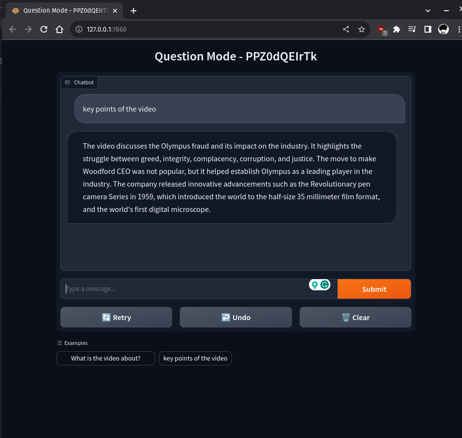
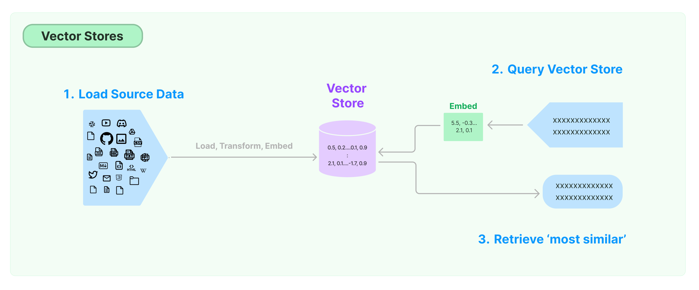
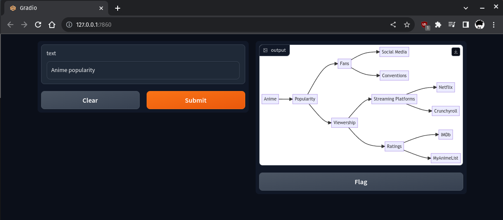

<div align="center">

# Project `Video to PPT`

A project to experiment with LLM's generate simple presentation from videos.

<a href="https://huggingface.co/spaces/zman1x1/yt-video-to-summary">


</a>

</div>

---

## Models

| Models | Templates |
|-|-|
| [OPENAI/gpt-3.5-turbo](https://platform.openai.com/docs/models/gpt-3-5)| `SUMMARY`, `TITLE GENERATION`, `SUMMARY V2` |
| [MBZUAI/LaMini-Flan-T5-248M](https://huggingface.co/MBZUAI/LaMini-Flan-T5-248M) | `SUMMARY`, `TITLE GENERATION`, `QA CHAT` |
| [google/flan-t5-large](https://huggingface.co/google/flan-t5-large) | `SUMMARY`, `TITLE GENERATION` |
| [sshleifer/distilbart-cnn-12-6](https://huggingface.co/sshleifer/distilbart-cnn-12-6) | `SUMMARY` |
|[fabiochiu/t5-small-medium-title-generation](https://huggingface.co/fabiochiu/t5-small-medium-title-generation) | `TITLE GENERATION` |

> **SUMMARY** - Generates summary of the video
> **TITLE GENERATION** - Generates title for the video
> **SUMMARY V2** - Generates summary of the video with more context. ( COSTLY/unoptimized )
> **QA CHAT** - A chatbot interface using vecorstores to quickly search for the related data and fed to the LLM's to generate the answer for the question.

## Installation

```bash
apt install git -y
git clone https://github.com/SaicharanKandukuri/project-video-to-ppt
cd project-video-to-ppt
pip install -r requirements.txt
```

## Usage

For basic command line usage to generate PPT

```bash
python3 main.py -v <video_id> --no-chapers
```

## GUI interfaces

All the task have a seperate GUI for this time being.

### Video To PPT

```bash
python3 main.py --gui-web
```

> Generates slides with video summary and convert to presentation or pdf

for any given video, the project will generate a summary of the video and will create a PPT/PPTX with different slides covering the summary of the video.

The video subtitles are fetched from youtube and fed to the LLM's to generate the summary of the video then the summary is used to create the PPT/PPTX with marp.

### Video TO Question-Answer interface



```bash
python3 main.py -v VIDEO_ID --questions-mode
```

QA interface uses vectorstores to quickly search for the related data and fed to the LLM's to generate the answer for the question.


> image source & refer about vector stores: [lanchain.com](https://python.langchain.com/docs/modules/data_connection/vectorstores/)

### Diagram generation

> Runs with GPT 3 for better reasoning capabilities

```bash
python3 main.py --diagram-gen
```


