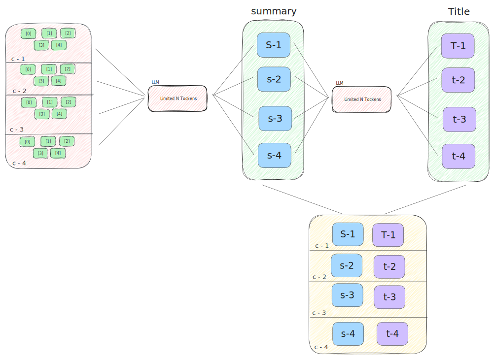

# Project `Video to PPT`

A project to convert a video data to a PPT/PPTX with different slides covering summary of the video.

## Getting Started

Project uses both Local LLM's and GPT 3.5 turbo api to generate the text from the target

> Its suggested to have a GPU for the project to run smoothly when using local LLMS

### Installation

```bash
apt install git -y
git clone https://github.com/SaicharanKandukuri/project-video-to-ppt
cd project-video-to-ppt
python3 -m venv proj
source proj/bin/activate
pip install -r requirements.txt
```

### Usage

```bash
python3 main.py -v <video_id> -o out.pdf
```

## Notes

### strategy 1


### strategy 2


### strategy 3



